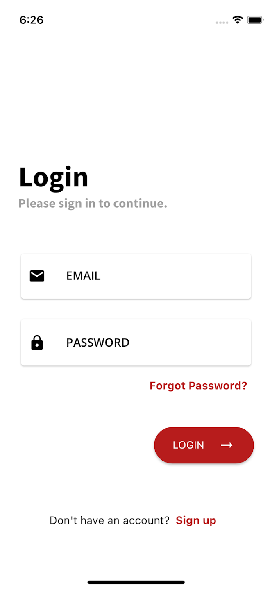
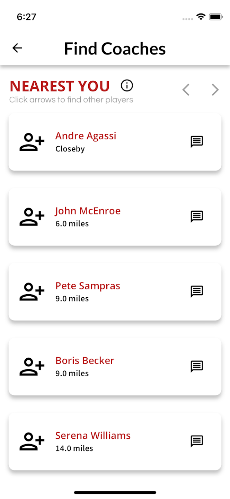

# The App - GoHit
As a long-time tennis player, I have personally experienced the problem of finding others to play tennis in a manner that is very beneficial to improvement, yet not requiring any charge or membership to a club. For this reason, I created the app called GoHit which allows registered users to find other players near them to practice with, free-of-charge. In the process, I have also developed a feature that allows for registration as a coach in order to support their business while also making it easier for tennis players to find a coach near them. The goal of this app is to provide the tennis community with a system that allows for savings in cost by means of less reliance on tennis clubs for practice and improvement. In the end, users are encouraged to make friends, have fun, improve, and just GO HIT!

## Features Successfully Implemented
- Registration and submission of information that is by no means specific, personal, or with the intent to be shared.
- Ability to find other players nearest an individual user's location.
- Ability to find coaches nearest an individual user's location.
- In-app messaging to allow two players to agree on a date and time by means of conversation.
- Settings (changing user info, deleting account, etc.).
- Player profiles.
- A successfully working database that allows for retrieval, creation, and restriction of data in order to maintain functionality of the app.
- Push notifications / alerts for messages as part of in-app texting.
- Personal reminders for scheduled match times, also shareable with other users.

## TO-DO
- A schedule, both for planning and for finding others available at the same time.
- A map used to visualize placement of users as well as perhaps tennis courts.

# The App Unveiled ...
Here are some screenshots showcasing the app:

  
  
  
  
  
  
  
  

# NOTE: NOT ALL CODE IS AVAILABLE FOR SECURITY PURPOSES
